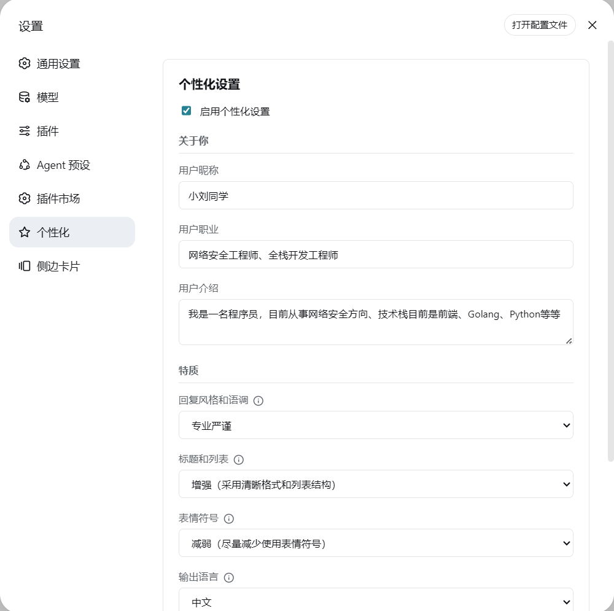
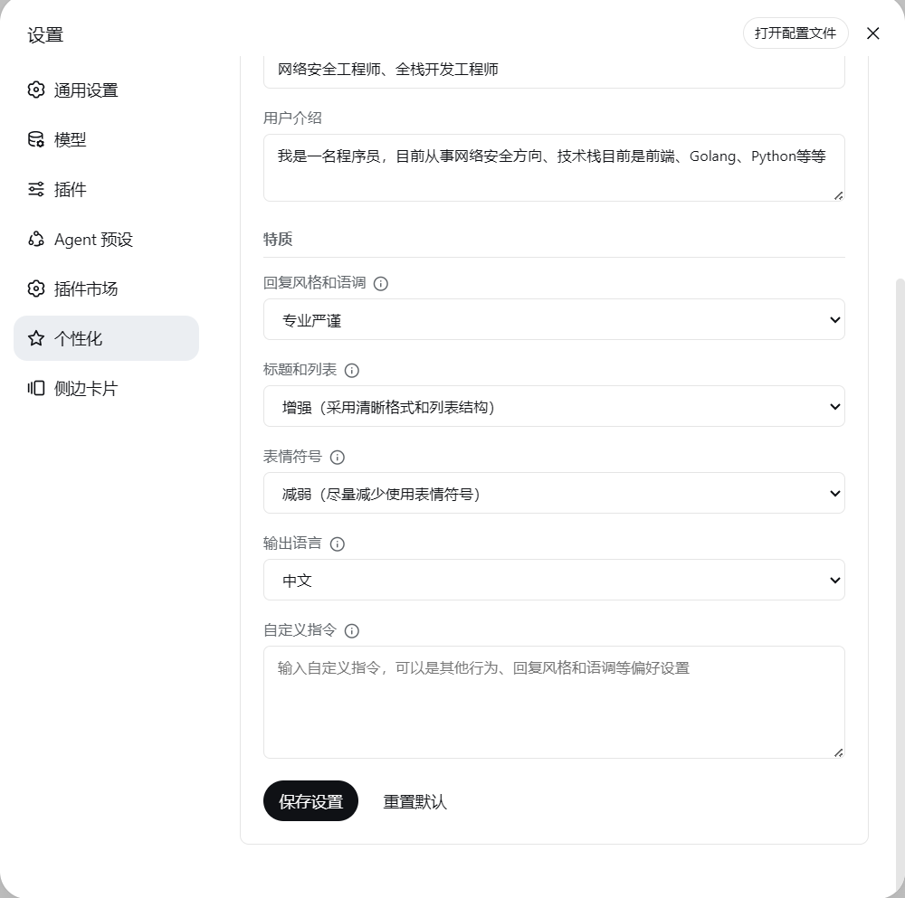

# dsh-soul

[简体中文](./README.md) | [English](./README_EN.md)

DeepSeek Harness 个性化设置插件，用于配置 Agent 的昵称、回复风格、语调和自定义指令。

## 功能

- Web UI 个性化设置页面
- 设置页体验：中英双语文案（随界面语言切换）、dirty 检测（无改动禁用保存）、保存结果提示、提示词预览只读面板
- 启用或禁用个性化设置
- 「关于你」：设置用户昵称、职业和介绍，回复时结合你的背景
- 选择回复风格和语调（合并为单一选项）：`professional`（专业严谨）、`casual`（轻松自然）、`humorous`（幽默风趣）、`roast`（吐槽达人）、`efficient`（高效干练）
- 特质微调（在风格和语调的基础上叠加）：
  - 标题和列表：`default`（默认）、`more`（增强，采用清晰格式和列表结构）、`less`（减弱，使用更多段落文本）
  - 表情符号：`default`（默认）、`more`（增强，使用较多表情符号）、`less`（减弱，尽量减少使用表情符号）
  - 表格：`default`（默认）、`more`（增强，呈现对比或多字段信息时优先使用表格）、`less`（减弱，避免表格、改用列表或段落）
- 回复长度偏好：`concise`（简洁，只讲要点、不展开）、`normal`（适中，不额外约束，默认）、`detailed`（详尽，充分展开背景、步骤与推理）
- 选择输出语言（Agent 回复语言 + `/soul` 命令输出语言）：中文 / English
- 提示词随输出语言本地化：`language=en` 时 system prompt 使用英文描述
- 输入自定义指令
- Agent 可调用工具 `set_persona`，让模型在对话中直接调整人设
- 人设预设：6 个内置人设（苏格拉底式提问者 / 极简主义者 / 资深架构师 / 教学型讲解者 / 严格代码审阅者 / 头脑风暴伙伴，随插件提供、不可删除）+ 多套自建人设一键切换（保存 / 使用 / 列表 / 删除，Web UI 与命令双入口）；每行摘要显示风格与偏离默认的维度
- `set_persona` 确认模式（`requireToolConfirmation`）：Agent 的人设修改需经 `/soul confirm` 确认后才生效
- 输入框光轨：Agent 回复中时，输入框边框显示沿边循环流动的光轨（默认颜色 `#679EFE`）
  - 颜色：预设色板、取色器或十六进制输入（如 `#679EFE`）
  - 流动速度：慢 / 中 / 快；光带粗细：细 / 中 / 粗
  - 光轨起点、终点沿边框匀速推进，带渐隐拖尾；与输入框边框完全重合，不出现双线
  - 设置页内置实时效果示例，随颜色 / 速度 / 粗细联动；系统开启「减少动态效果」时自动停用
- `/soul set` 键值方式修改配置项
- 配置持久化保存
- 配置输入校验：字段白名单、类型、长度上限（昵称/职业 50、介绍 500、自定义指令 2000 字符）、枚举与十六进制颜色校验，非法或超限字段整单拒绝
- 配置持久化健壮性：写入为**原子替换**（先写临时文件再 `rename`，中断不会留下半份配置）；读取区分「文件不存在」与「文件损坏」——损坏时保留原文件、另存 `.corrupt` 备份、**拒绝覆写**，并把原因直接显示在设置页，避免自定义指令与人设库被静默清空
- 提示词插值已关闭：自定义指令里的 `{{…}}` 按字面保留，不会触发宿主提示词装配失败
- 配置更新后自动生效：只注册一个 system prompt section，宿主每一步都会重新装配并求值，**不需要向会话注入任何消息**
- 变更检测：仅在影响 Agent 行为的配置实际变化时刷新提示词；纯外观配置（输入框光轨）只落盘，不影响提示词
- 插件图标：插件管理列表与侧栏入口显示专属图标（`assets/icon.svg`，36×36，随 npm 包发布）
- 设置导航图标：设置面板左侧「个性化」那一项显示与插件图标同一套几何的图标——同一条光轨与火花，颜色与线宽则跟随邻居（单色 `currentColor`）；DSH 的导航图标按 section id 硬编码、插件声明不了，故由客户端做 DOM 替换
- 提示词预览（只读，设置页底部折叠区）：无未保存编辑时显示**当前生效**的提示词；表单一有改动就转为预览**草稿**——展示保存后真正会生效的内容，边改边看（停止输入 400ms 后自动重新编译），并在保存 / 重置 / 应用预设后自动刷新。未通过校验的字段会单独列出且不计入预览

## 安装

```powershell
dsh plugin --profile web add dsh-soul
dsh plugin --profile web update dsh-soul
```

插件配置由 `cordis.patch.yml` 提供：

```yaml
- insert:
    - id: soul
      name: dsh-soul
```

## 兼容性

插件不打包 DSH 运行时包，全部由宿主提供。DSH 会在装载前校验 `peerDependencies`，**比较对象是 DSH 运行时版本**（`@deepseek-ai/dsh-app-boot` 的 version），而不是这些包各自的版本：

| 包 | 范围 |
| --- | --- |
| `@deepseek-ai/dsh-tools` | `>=0.1.0-rc.6 <0.3.0-0` |
| `@deepseek-ai/cordis` | `^4.0.1 \|\| ^4.0.5-alpha.1` |

即支持 DSH **0.1.x 与 0.2.x**（含 prerelease 版本）。可用 `npm run verify:compat` 在当前环境确认声明是否成立。

若 DSH 提示「dsh-soul@x.y.z 与 DSH a.b.c 不兼容」，说明插件版本早于该 DSH 版本，升级插件即可：

```powershell
dsh plugin --profile web update dsh-soul
```

## 截图

**设置页（关于你 + 特质）**



**设置页（特质 + 输出语言 + 自定义指令）**



**`/soul` 命令提示**


**`/soul` 命令输出（设置昵称、show、enable、disable、reset）**


## 使用

启动 DSH 后，进入设置页面中的「个性化设置」栏目，修改配置并点击「保存设置」。

也可以使用斜杠命令：

```text
/soul show        查看当前配置（含确认模式与预设数量）
/soul set k=v     修改配置项（如 /soul set style=humorous language=en；光轨：trailColor=#679EFE trailSpeed=fast trailWidth=thick）
/soul save <名>   保存当前配置为人设预设（内置名不可占用）
/soul use <名>    应用人设预设（内置预设同样可用）
/soul list        查看人设预设（✔ 标记当前匹配项；内置项带 [内置] 标记）
/soul del <名>    删除人设预设（delete / rm 别名；内置预设不可删）
/soul confirm     应用待确认的人设变更（确认模式）
/soul reject      拒绝待确认的人设变更
/soul reset       重置配置（保留人设预设库）
/soul enable      启用个性化设置
/soul disable     禁用个性化设置
/soul 小明        设置昵称
```

配置保存后**下一次请求即生效**：宿主在每一步都会重新装配系统提示词并重新求值本插件的 section，文本变化时由宿主自行提交新的 system 快照。因此不需要重启、不需要重新加载插件，也**不会向会话写入任何额外消息**。

Agent 也可以通过工具 `set_persona` 在对话中直接调整你的人设（昵称、回复风格和语调、特质、回复语言、自定义指令）。模型只会在明确请求改变称呼、语气、风格或语言时调用该工具。开启「人设变更需确认」（`requireToolConfirmation`）后，该工具的修改会以待确认提议返回，需使用 `/soul confirm` 确认或 `/soul reject` 拒绝后才会生效。

## 配置文件

插件将配置保存到 DSH 的用户数据目录，文件名为：

```text
soul-config.json
```

配置示例：

```json
{
  "enabled": true,
  "nickname": "小明",
  "occupation": "软件工程师",
  "bio": "对编程和技术感兴趣",
  "style": "professional",
  "language": "zh",
  "customInstructions": "请保持简洁，优先给出结论。",
  "requireToolConfirmation": false,
  "trailEnabled": true,
  "trailColor": "#679EFE",
  "trailSpeed": "slow",
  "trailWidth": "thin"
}
```

自建人设预设保存在同一文件的 `personas` 字段：名称 → 人设字段快照（昵称/职业/介绍/风格/特质/回复长度/语言/自定义指令）+ `updatedAt`；预设库变更不影响活动配置，使用预设时才应用到配置并刷新提示词。内置人设不落盘（见 `lib/personas.mjs`），列表 / 使用 / ★ 匹配统一走「内置 + 自建」的合并视图，同名以内置为准，内置名既不可保存占用也不可删除。

输入框光轨字段：`trailEnabled`（是否启用，默认 `true`）、`trailColor`（6 位十六进制颜色，统一大写存储，默认 `#679EFE`）、`trailSpeed`（`slow` / `normal` / `fast`，默认 `slow`）、`trailWidth`（`thin` / `normal` / `thick`，默认 `thin`）。这四个字段属纯外观配置，只落盘、不进入 system prompt、不触发提示词刷新。

字段长度上限：昵称 / 职业 50 字符，介绍 500 字符，自定义指令 2000 字符；颜色必须为 `#rrggbb` 形式。未知字段会被丢弃，非法或超限字段整单拒绝（HTTP 返回 400 与字段级错误明细）。

## 实现原理

插件通过 `compilePrompt()` 将昵称、风格、语调与自定义指令编译成 system prompt，注册为 DSH 的一个提示词 section：

```js
spCtx.systemPrompt.section({
  name: 'soul:persona',
  order: 0,
  interpolate: false,                                        // 关闭宿主插值，{{…}} 按字面保留
  text: () => compilePrompt(configCache || DEFAULT_CONFIG)    // 函数式 provider：每次装配重新求值
})
```

**为什么不需要注入会话**：DSH 在每一个 step 之前都会重新装配系统提示词，且对函数式 `text` **不做缓存**（每次调用重新求值）；一旦装配结果与上一步不同，宿主自己会提交一份新的 system 快照。因此「改配置 → 下一次请求生效」完全由这条链路保证，插件侧只需要更新配置缓存。

`interpolate: false` 是必须的：宿主默认对 section 文本做**严格**插值，变量名不合规或未注册都会让装配抛错，而该抛错位于 `agent.step()` 开头且无 try/catch —— 结果不是「忽略那段文字」，而是**该会话每一轮都失败**。插件不使用任何宿主提示词变量，关闭插值的代价为 0。

0.7.0 及更早版本还会遍历所有活动 Agent、用 `agent.inject()` 塞一条配置快照。那条消息是 **user 角色**且会落进会话记录（相当于把系统指令伪装成用户发言、并复制一份人设全文进上下文），同时也是 DSH 会话格式 v4 准入失败（[#1](https://github.com/Aliuyanfeng/dsh-soul/issues/1)）的唯一触发源 —— 0.7.1 起已整体移除。

## 许可证

MIT License
