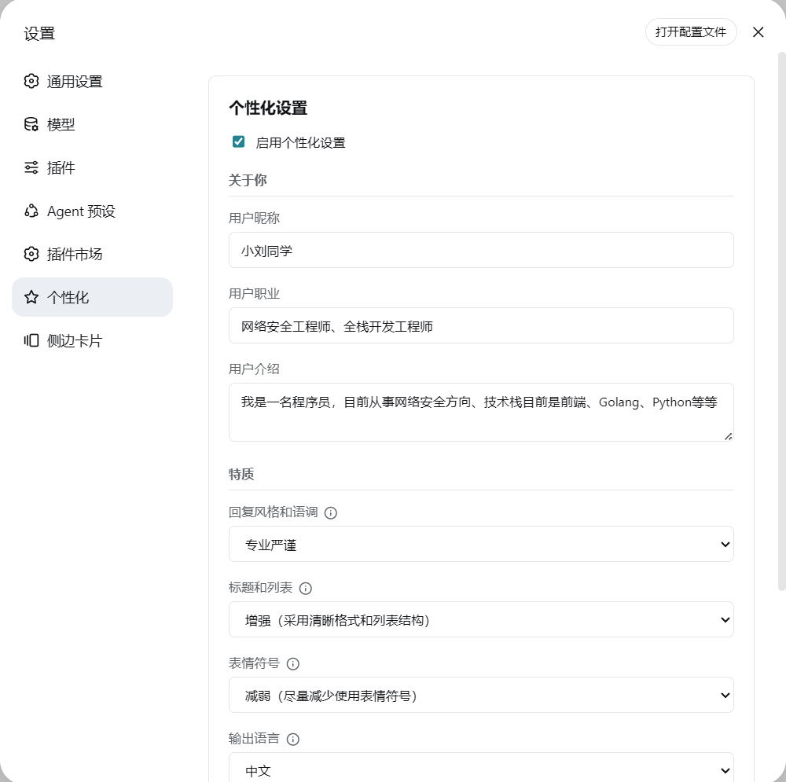
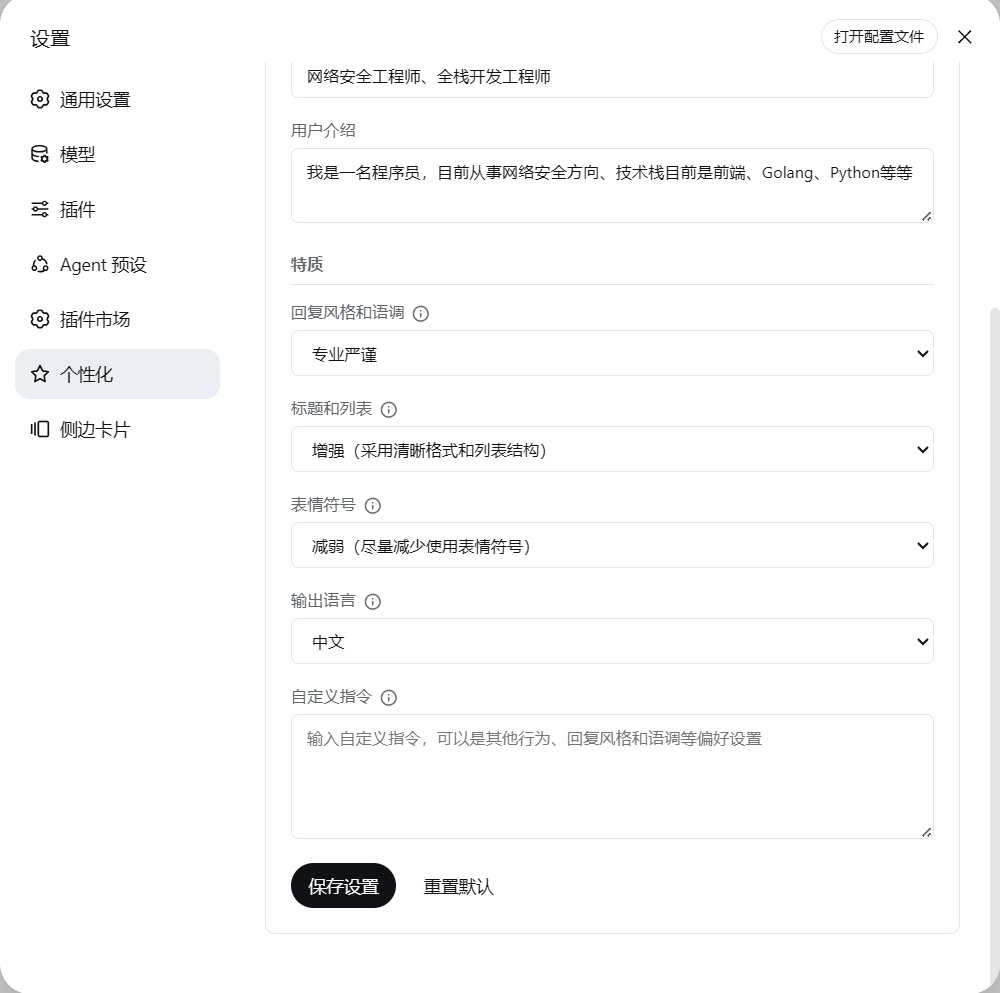

[简体中文](./README.md) | [English](./README_EN.md)

# dsh-soul

A personalization plugin for DeepSeek Harness (DSH). Configure your agent's nickname, reply style, tone, and custom instructions.

## Features

- Personalization settings page in the Web UI
- Localized settings UI (English/Chinese, follows the interface language), dirty tracking (save disabled when unchanged), save-result toasts, and a read-only "active prompt" viewer
- Enable or disable personalization
- "About you": set your nickname, occupation and bio so replies fit your background
- Combined style & tone option: `professional`, `casual`, `humorous`, `roast`, `efficient`
- Trait fine-tuning (layered on top of style & tone):
  - Headings & lists: `default`, `more` (clear formatting with headings and lists), `less` (more paragraph text)
  - Emoji: `default`, `more` (frequent emoji usage), `less` (minimal emoji usage)
- Output language (agent reply language + `/soul` command output language): Chinese or English
- The compiled system prompt follows the output language (English descriptions when `language=en`)
- Custom instructions
- Agent-callable tool `set_persona` to let the model adjust persona during a conversation
- Configuration persisted to disk
- Input validation: field whitelist, types, length limits (nickname/occupation 50, bio 500, custom instructions 2000 chars) and enum checks; invalid or oversized fields reject the whole write
- Configuration synced to all active agents after every update
- Change detection: the prompt is refreshed and sessions injected only when the configuration actually changed — no-op saves inject nothing

## Installation

```powershell
dsh plugin --profile web add dsh-soul
dsh plugin --profile web update dsh-soul
```

The plugin is registered via `cordis.patch.yml`:

```yaml
- insert:
    - id: soul
      name: dsh-soul
```

## Screenshots

**Settings page (About you + Traits)**



**Settings page (Traits + Output language + Custom instructions)**



**`/soul` command prompt**


**`/soul` command output (set nickname, show, enable, disable, reset)**


## Usage

After starting DSH, open the **Personalization** section on the settings page, edit the configuration and click **Save Settings**.

Slash commands are also available:

```text
/soul show       Show current configuration
/soul reset      Reset configuration
/soul enable     Enable personalization
/soul disable    Disable personalization
/soul Bob        Set nickname
```

Once saved, the configuration is synced to all active agents and takes effect on the next request in the current session.

The agent can also use the `set_persona` tool to adjust your persona (nickname, style & tone, traits, reply language, custom instructions) during a conversation. The model only invokes this tool when you explicitly ask to change how it addresses or responds to you.

## Configuration File

The configuration is stored in the DSH user data directory:

```text
soul-config.json
```

Example:

```json
{
  "enabled": true,
  "nickname": "Bob",
  "occupation": "Software Engineer",
  "bio": "Interested in programming and technology",
  "style": "professional",
  "language": "en",
  "customInstructions": "Be concise and lead with the conclusion."
}
```

Length limits: nickname / occupation 50 chars, bio 500 chars, custom instructions 2000 chars. Unknown fields are dropped; invalid or oversized fields reject the whole write (HTTP returns 400 with per-field error details).

## How It Works

The plugin compiles the nickname, style, tone and custom instructions into a system prompt via `compilePrompt()` and registers it with DSH:

```js
spCtx.systemPrompt.section({
  name: 'soul:persona',
  order: 0,
  text: () => compilePrompt(configCache || DEFAULT_CONFIG)
})
```

After each update, the plugin iterates over all active agents and calls `agent.inject()` with a standard `UserMessage`:

```js
agent.inject(createUserMessage({
  content: [{ type: 'text', text: prompt }],
  source: {
    kind: 'plugin',
    plugin: 'dsh-soul',
    form: 'snapshot',
    sections: [{ name: 'soul:persona', text: prompt }]
  }
}))
```

`agent.inject()` places the latest configuration into the agent's pending context so it takes effect on the next request. It does not trigger a new request and does not modify message history.

## License

MIT License
